# P5.3 - Informe RA3

## Índice
- [Evidencias de la P5.2](#41-reúne-evidencias-de-la-p52)
- [a) Criterio A - Descripción de componentes y funcionamiento](#a-criterio-a---descripción-de-componentes-y-funcionamiento)
- [b) Criterio B - Archivos de configuración y bibliotecas compartidas](#b-criterio-b---archivos-de-configuración-y-bibliotecas-compartidas)
- [c) Criterio C - Cooperación con servidor web (reverse proxy y HTTPS)](#c-criterio-c---cooperación-con-servidor-web-reverse-proxy-y-https)
- [d) Criterio D - Mecanismos de seguridad del servidor de aplicaciones](#d-criterio-d---mecanismos-de-seguridad-del-servidor-de-aplicaciones)
- [e) Criterio E - Componentes web del servidor de aplicaciones](#e-criterio-e---componentes-web-del-servidor-de-aplicaciones)
- [f) Criterio F - Parámetros necesarios para el despliegue](#f-criterio-f---parámetros-necesarios-para-el-despliegue)
- [g) Criterio G - Pruebas de funcionamiento y rendimiento](#g-criterio-g---pruebas-de-funcionamiento-y-rendimiento)
- [h) Criterio H - Documentación de administración y recomendaciones](#h-criterio-h---documentación-de-administración-y-recomendaciones)
- [i) Criterio I - Virtualización, nube o contenedores en el despliegue](#i-criterio-i---virtualización-nube-o-contenedores-en-el-despliegue)

---

## Evidencias de la P5.2

### Contenedor WildFly levantado

Verificación del estado del contenedor WildFly:

```powershell
docker ps
```

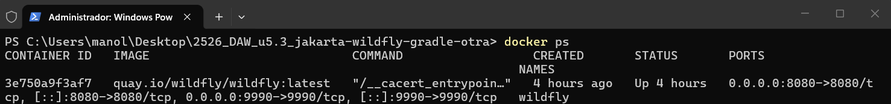

#### Puertos publicados (8080 y 9990)

Los puertos expuestos son:
- **8080**: Puerto HTTP para acceso a las aplicaciones desplegadas
- **9990**: Puerto de administración de WildFly

Verificación de puertos:

```powershell
docker port wildfly
```

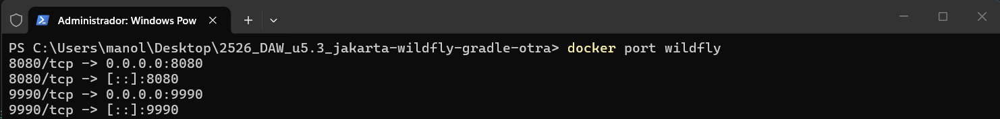

#### Despliegue del WAR

Compilación del proyecto:

```powershell
cd C:\Users\manol\Desktop\2526_DAW_u5.3_jakarta-wildfly-gradle-otra
.\gradlew clean build
```

Copia del WAR al contenedor:

```powershell
docker cp build/libs/crud-file.war wildfly:/opt/jboss/wildfly/standalone/deployments/
```

Verificación de logs de WildFly:

```powershell
docker logs -f wildfly
```
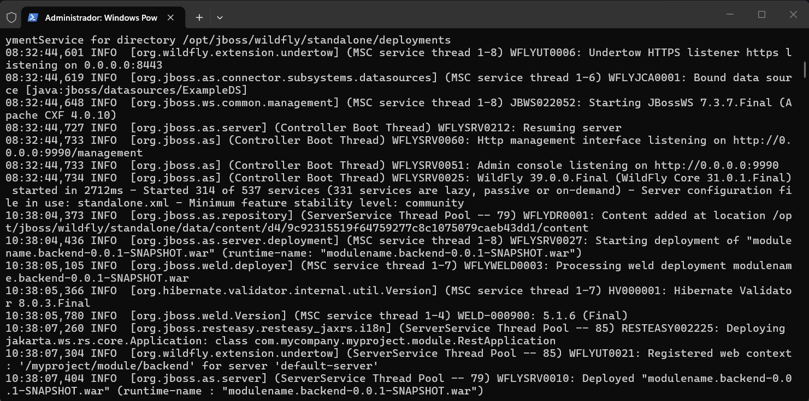

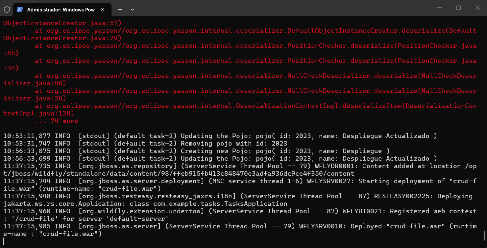

#### Pruebas funcionales con navegador

Acceso a la aplicación mediante navegador:

```
http://localhost:8080/crud-file/
```

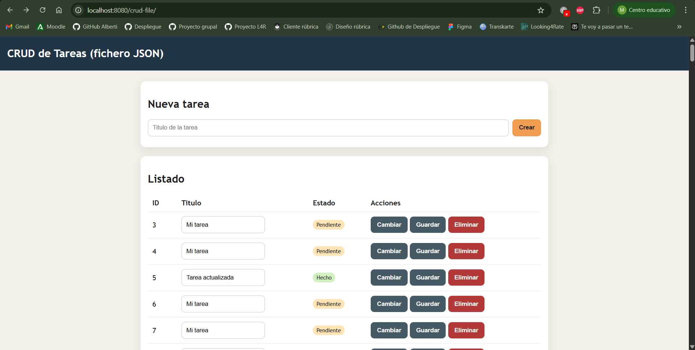

Acceso al endpoint de la API:

```
http://localhost:8080/crud-file/api/tasks
```

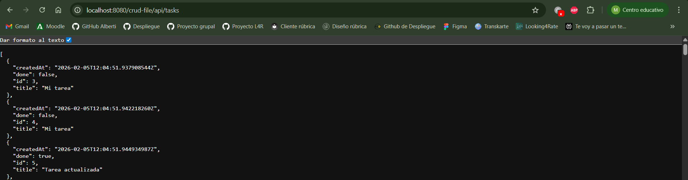

#### Pruebas funcionales con curl

##### GET - Listar todas las tareas

```powershell
curl http://localhost:8080/crud-file/api/tasks
```

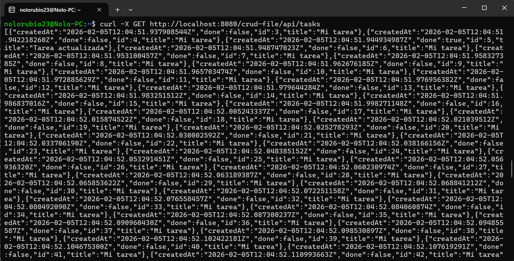

##### POST - Crear una tarea

```powershell
curl -X POST -H "Content-Type: application/json" -d "{\"title\":\"Tarea de prueba\"}" http://localhost:8080/crud-file/api/tasks
```

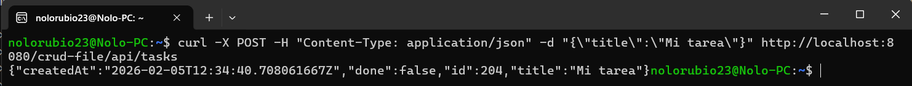

##### PUT - Actualizar una tarea

```powershell
curl -X PUT -H "Content-Type: application/json" -d "{\"title\":\"Tarea actualizada\",\"done\":true}" http://localhost:8080/crud-file/api/tasks/1
```

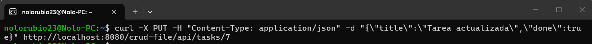

##### DELETE - Eliminar una tarea

```powershell
curl -X DELETE http://localhost:8080/crud-file/api/tasks/1
```

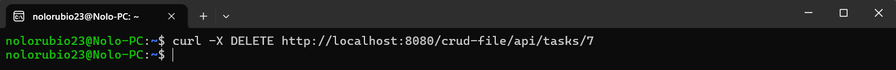

---

## a) Criterio A - Descripción de componentes y funcionamiento

### Componentes y servicios del despliegue

El despliegue de la aplicación P5.2 involucra los siguientes componentes:

#### 1. **Contenedor Docker**
- **Función**: Proporciona un entorno aislado y reproducible para ejecutar WildFly
- **Imagen utilizada**: `quay.io/wildfly/wildfly`
- **Configuración**: Puertos expuestos (`8080:8080` y `9990:9990`)
- **Ventajas**: Portabilidad, aislamiento de dependencias, facilidad de despliegue

#### 2. **Servidor de aplicaciones WildFly**
- **Función**: Contenedor de servlets y servidor de aplicaciones Jakarta EE que gestiona el ciclo de vida de la aplicación WAR
- **Responsabilidades**:
  - Gestión de peticiones HTTP
  - Inyección de dependencias
  - Gestión de transacciones
  - Serialización/deserialización JSON (JSON-B)
  - Enrutamiento de endpoints REST (JAX-RS)

#### 3. **Aplicación WAR (crud-file.war)**
- **Función**: Paquete desplegable que contiene toda la lógica de la aplicación
- **Contenido**:
  - Clases Java compiladas (`TaskResource.java`, `Task.java`, `TaskStore.java`, `FileTaskStore.java`)
  - Archivos de configuración (`web.xml`, `jboss-web.xml`)
  - Recursos estáticos (`index.html`)
- **Contexto**: `/crud-file` (definido en `jboss-web.xml`)

#### 4. **Puertos expuestos**
- **Puerto 8080 (HTTP)**:
  - Función: Puerto principal para tráfico HTTP de aplicaciones
  - Uso: Acceso a la aplicación web y endpoints REST
  - URL: `http://localhost:8080/crud-file/`
  
- **Puerto 9990 (Administración)**:
  - Función: Consola de administración de WildFly
  - Uso: Gestión del servidor, despliegue de aplicaciones, monitorización
  - URL: `http://localhost:9990/console`

#### 5. **Endpoint REST (/api/tasks)**
- **Función**: API RESTful para operaciones CRUD sobre tareas
- **URL base**: `http://localhost:8080/crud-file/api/tasks`
- **Operaciones soportadas**:
  - `GET /api/tasks` - Listar todas las tareas
  - `GET /api/tasks/{id}` - Obtener una tarea específica
  - `POST /api/tasks` - Crear nueva tarea
  - `PUT /api/tasks/{id}` - Actualizar tarea existente
  - `DELETE /api/tasks/{id}` - Eliminar tarea

### Flujo de una petición HTTP

**Ejemplo: GET http://localhost:8080/crud-file/api/tasks**

```
1. Cliente (navegador/curl/HEY)
   ↓ Envía petición HTTP GET
   
2. Docker (Puerto 8080 host → contenedor)
   ↓ Redirige al contenedor
   
3. WildFly
   ↓ Recibe petición
   ↓ Identifica contexto: /crud-file
   ↓ Enruta a: /api/tasks
   
4. TaskResource.list()
   ↓ Ejecuta STORE.findAll()
   
5. FileTaskStore
   ↓ Lee tasks.json
   ↓ Deserializa a List<Task>
   
6. Respuesta
   ↓ Serializa a JSON
   ↓ HTTP 200 + Content-Type: application/json
   ↓ Retorna a través de Docker
   
7. Cliente recibe JSON con las tareas
```

### Evidencias

Las siguientes evidencias se encuentran documentadas en la sección [4.1. Reúne evidencias de la P5.2](#41-reúne-evidencias-de-la-p52):

1. **Contenedor Docker activo** (`docker ps`):
   - Muestra el contenedor `wildfly` en ejecución
   - Puertos mapeados: `8080:8080` y `9990:9990`
   - Estado: `Up`

2. **Logs de WildFly** (`docker logs -f wildfly`):
   - Confirmación del despliegue exitoso de `crud-file.war`
   - Mensajes de inicio del servidor

3. **Pruebas funcionales con curl**:
   - GET: Listado de tareas en formato JSON
   - POST: Creación de tarea con respuesta 201
   - PUT: Actualización de tarea
   - DELETE: Eliminación con código 204

4. **Navegador**:
   - Acceso a `index.html` en `/crud-file/`
   - Respuesta JSON del endpoint `/crud-file/api/tasks`

---

## b) Criterio B - Archivos de configuración y bibliotecas compartidas

### Archivos principales de configuración de WildFly

#### 1. **standalone.xml**

**Ruta dentro del contenedor:**
```
/opt/jboss/wildfly/standalone/configuration/standalone.xml
```

**Función:** Archivo de configuración principal de WildFly en modo standalone (servidor único).

**Ajustes relevantes para el despliegue:**

- **Subsistema de datasources**: Configuración de conexiones a bases de datos
  ```xml
  <subsystem xmlns="urn:jboss:domain:datasources:7.0">
    <datasources>
      <datasource jndi-name="java:jboss/datasources/ExampleDS" ...>
  ```

- **Subsistema web (Undertow)**: Configuración del servidor HTTP
  ```xml
  <subsystem xmlns="urn:jboss:domain:undertow:14.0">
    <server name="default-server">
      <http-listener name="default" socket-binding="http" .../>
  ```

- **Socket bindings**: Puertos de escucha
  ```xml
  <socket-binding-group name="standard-sockets" ...>
    <socket-binding name="http" port="${jboss.http.port:8080}"/>
    <socket-binding name="management-http" port="${jboss.management.http.port:9990}"/>
  ```

- **Deployment scanner**: Escaneo automático de aplicaciones
  ```xml
  <subsystem xmlns="urn:jboss:domain:deployment-scanner:2.0">
    <deployment-scanner path="deployments" .../>
  ```

- **Logging**: Configuración de logs
  ```xml
  <subsystem xmlns="urn:jboss:domain:logging:8.0">
  ```

#### 2. **logging.properties**

**Ruta:**
```
/opt/jboss/wildfly/standalone/configuration/logging.properties
```

**Función:** Configuración del sistema de logging de WildFly.

#### 3. **application-users.properties y application-roles.properties**

**Rutas:**
```
/opt/jboss/wildfly/standalone/configuration/application-users.properties
/opt/jboss/wildfly/standalone/configuration/application-roles.properties
```

**Función:** Gestión de usuarios y roles para autenticación en aplicaciones.

### Bibliotecas compartidas y dependencias "provided"

#### Dependencias marcadas como `compileOnly` (provided)

En el archivo `build.gradle` de nuestro proyecto:

```gradle
dependencies {
    compileOnly 'jakarta.platform:jakarta.jakartaee-api:10.0.0'
}
```

**Análisis:**

- **`compileOnly`**: Indica que la dependencia es necesaria en tiempo de compilación pero NO se incluirá en el WAR
- **`jakarta.platform:jakarta.jakartaee-api`**: API completa de Jakarta EE 10

### Ventajas del modelo "provided"

1. **Reducción del tamaño del WAR**
2. **Gestión centralizada de versiones**
3. **Evita conflictos de dependencias**
4. **Cumplimiento del estándar Jakarta EE**

### Evidencias

#### Listado de archivos de configuración

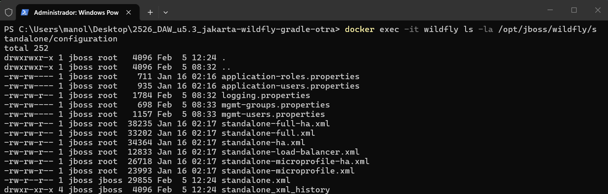

#### Fragmento de build.gradle mostrando dependencias "provided"

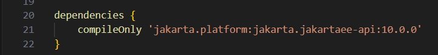

---

## c) Criterio C - Cooperación con servidor web (reverse proxy y HTTPS)

### Arquitectura actual vs. propuesta con Nginx

#### Despliegue actual (P5.2)
```
Cliente → localhost:8080 → WildFly
Cliente → localhost:9990 → WildFly Admin
```

**Problemas:**
- Puertos del servidor de aplicaciones expuestos directamente
- Puerto de administración (9990) accesible públicamente
- Sin encriptación (HTTP plano)
- Sin balanceo de carga ni caché

#### Arquitectura propuesta con Nginx
```
Cliente → https://dominio.com (443)
         ↓
    [Nginx - Reverse Proxy]
         ↓
    WildFly:8080 (solo red interna)
         
Puerto 9990: NO EXPUESTO (solo accesible dentro del contenedor)
```

### Configuración de Reverse Proxy con Nginx

#### 1. Estructura Docker Compose

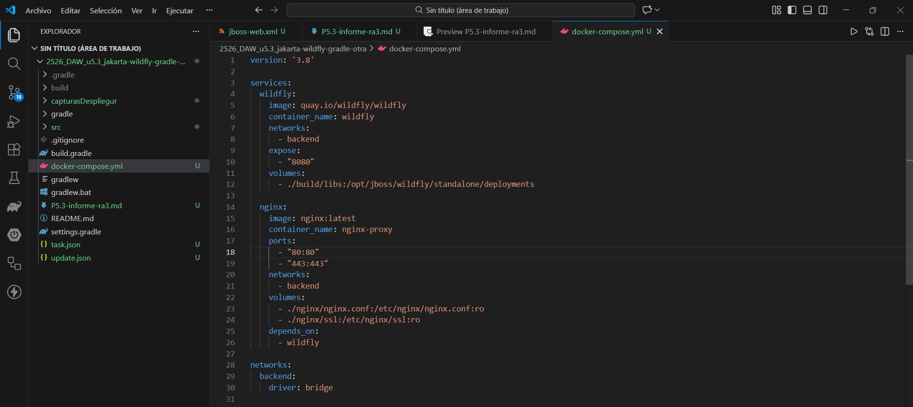

**Cambios respecto al despliegue actual:**
- WildFly ya NO expone puertos al host (`expose` en lugar de `ports`)
- Nginx es el único punto de entrada (puertos 80 y 443)
- Red interna `backend` para comunicación entre contenedores
- Puerto 9990 completamente inaccesible desde fuera

#### 2. Configuración de Nginx (fragmentos clave)

**Upstream para WildFly:**
```nginx
upstream wildfly_backend {
    server wildfly:8080;
}
```

**Redirección HTTP → HTTPS:**
```nginx
server {
    listen 80;
    server_name api.midominio.com;
    
    location / {
        return 301 https://$server_name$request_uri;
    }
}
```

**Configuración HTTPS y proxy hacia WildFly:**
```nginx
server {
    listen 443 ssl http2;
    server_name api.midominio.com;

    # Certificados TLS
    ssl_certificate /etc/nginx/ssl/certificate.crt;
    ssl_certificate_key /etc/nginx/ssl/private.key;

    # Proxy para la API REST
    location /api/ {
        proxy_pass http://wildfly_backend/crud-file/api/;
        proxy_set_header X-Forwarded-Proto $scheme;
        proxy_set_header X-Real-IP $remote_addr;
    }
}
```

### Configuración TLS/HTTPS

#### Ventajas de TLS/HTTPS

1. Encriptación de datos en tránsito
2. Autenticación del servidor
3. Integridad de datos
4. Cumplimiento normativo
5. SEO y confianza del navegador

#### ¿Cambios necesarios en WildFly o la aplicación?

Esto no afectaria a Wildfly ni a la aplicación/es y no se requiririan cambios en ellos

- **WildFly**: Continúa escuchando en HTTP plano (puerto 8080)
- **Aplicación WAR**: No necesita modificaciones

**Ventaja de este enfoque:**
- Separación de responsabilidades
- WildFly se enfoca en la lógica de negocio
- Certificados gestionados centralizadamente

### Evidencias

#### Fragmento de configuración Nginx

**nginx.conf** (sección principal):
```nginx
upstream wildfly_backend {
    server wildfly:8080;
}

server {
    listen 443 ssl http2;
    server_name api.midominio.com;

    ssl_certificate /etc/nginx/ssl/certificate.crt;
    ssl_certificate_key /etc/nginx/ssl/private.key;

    location /api/ {
        proxy_pass http://wildfly_backend/crud-file/api/;
        proxy_set_header X-Forwarded-Proto $scheme;
    }
}
```

#### Configuración de puertos Docker

**Puertos publicados al host:**
```yaml
nginx:
  ports:
    - "80:80"    # HTTP (redirige a HTTPS)
    - "443:443"  # HTTPS - ÚNICO PUNTO DE ENTRADA
```

**Puertos NO publicados:**
```yaml
wildfly:
  expose:
    - "8080"   # Accesible solo desde Nginx
  # Puerto 9990: NO expuesto en ningún sitio
```

#### Configuración TLS

**Certificados generados:**
```
nginx/ssl/
├── certificate.crt    # Certificado público
└── private.key        # Clave privada
```

**Ventajas implementadas:**
- Redirección automática HTTP → HTTPS
- Headers de seguridad (HSTS, X-Frame-Options, etc.)
- Sin cambios en la aplicación Java

---

## d) Criterio D - Mecanismos de seguridad del servidor de aplicaciones

### Medidas de seguridad en el despliegue P5.2 (estado inicial)

#### 1. Contenedor Docker con imagen oficial de WildFly
- Uso de imagen `quay.io/wildfly/wildfly` oficial
- Aislamiento del servidor mediante contenedores
- Entorno reproducible y controlado

#### 2. Despliegue mediante WAR empaquetado
- Aplicación empaquetada como archivo WAR
- Separación de código y configuración mediante `web.xml` y `jboss-web.xml`

#### 3. Logs del servidor habilitados
- WildFly genera logs por defecto en `/opt/jboss/wildfly/standalone/log/server.log`
- Registro de despliegues y accesos HTTP

#### 4. Contexto de aplicación definido
- Aplicación accesible mediante contexto `/crud-file/`
- Separación lógica de aplicaciones en el mismo servidor

### Medidas de seguridad para producción

#### 1. Consola de administración (9990) y credenciales

**Problema identificado:**
- Puerto 9990 expuesto públicamente
- Sin autenticación configurada
- Acceso total a la administración del servidor

**Medidas a aplicar:**

**a) Eliminar exposición pública del puerto 9990:**

```yaml
wildfly:
  expose:
    - "8080"
```

**b) Crear usuario administrador:**

```powershell
docker exec -it wildfly /opt/jboss/wildfly/bin/add-user.sh

# Tipo: Management User
# Usuario: Nolorubio23
# Password: Contraseña personal del usuario
# Groups: ManagementRealm
```

**c) Acceso a la consola solo mediante Docker exec:**

```powershell
docker exec -it wildfly /opt/jboss/wildfly/bin/jboss-cli.sh --connect

Username: Nolorubio23
Password: ******
```

**Justificación:**
- Elimina acceso público a funciones administrativas
- Requiere acceso SSH/Docker al host
- Requiere credenciales de WildFly

#### 2. Exposición de puertos

**Problema identificado:**
- Puertos 8080 y 9990 expuestos directamente
- Comunicación HTTP sin encriptación
- Servidor de aplicaciones accesible desde Internet

**Medidas a aplicar:**

**a) Implementar reverse proxy con Nginx:**

```yaml
# docker-compose.yml
services:
  wildfly:
    expose:
      - "8080"
    networks:
      - backend
  
  nginx:
    ports:
      - "443:443"
    networks:
      - backend

networks:
  backend:
    internal: true
```

**b) Configurar TLS/HTTPS en Nginx:**

```nginx
server {
    listen 443 ssl http2;
    ssl_certificate /etc/nginx/ssl/certificate.crt;
    ssl_certificate_key /etc/nginx/ssl/private.key;
    
    location /api/ {
        proxy_pass http://wildfly:8080/crud-file/api/;
    }
}
```

**Justificación:**
- Puerto de aplicaciones no accesible directamente
- Puerto de administración completamente aislado
- Reduce superficie de ataque

#### 3. Gestión de secretos (usuarios/contraseñas)

**Problema identificado:**
- Si se añaden conexiones a BD o APIs, las credenciales estarían en `standalone.xml` en texto plano

**Medidas a aplicar:**

- **Usar Docker Secrets:**

```yaml
# docker-compose.yml
services:
  wildfly:
    environment:
      - DB_USERNAME_FILE=/run/secrets/db_username
      - DB_PASSWORD_FILE=/run/secrets/db_password
    secrets:
      - db_username
      - db_password

secrets:
  db_username:
    file: ./secrets/db_username.txt
  db_password:
    file: ./secrets/db_password.txt
```

**Justificación:**
- Secretos fuera del control de versiones
- Facilita rotación de credenciales

#### 4. Registro y trazabilidad (logs)

**Problema identificado:**
- Logs solo en `/opt/jboss/wildfly/standalone/log/server.log` dentro del contenedor
- Sin rotación automática
- Sin centralización ni análisis

**Medidas a aplicar:**

**a) Configurar rotación de logs en WildFly:**

Modificar `standalone.xml`:
```xml
<subsystem xmlns="urn:jboss:domain:logging:8.0">
    <periodic-rotating-file-handler name="FILE">
        <file relative-to="jboss.server.log.dir" path="server.log"/>
        <suffix value=".yyyy-MM-dd"/>
        <append value="true"/>
    </periodic-rotating-file-handler>
    
    <size-rotating-file-handler name="FILE-SIZE">
        <file relative-to="jboss.server.log.dir" path="server.log"/>
        <rotate-size value="10M"/>
        <max-backup-index value="5"/>
    </size-rotating-file-handler>
</subsystem>
```

**b) Centralizar logs con Docker logging driver:**

```yaml
# docker-compose.yml
services:
  wildfly:
    logging:
      driver: "json-file"
      options:
        max-size: "10m"
        max-file: "3"
        labels: "service=wildfly,env=production"
```

**c) Configurar formato JSON para análisis:**

```xml
<subsystem xmlns="urn:jboss:domain:logging:8.0">
    <json-formatter name="json">
        <exception-output-type>formatted</exception-output-type>
        <record-delimiter>&#10;</record-delimiter>
    </json-formatter>
    <periodic-rotating-file-handler name="FILE">
        <named-formatter name="json"/>
        <file relative-to="jboss.server.log.dir" path="server.log"/>
        <suffix value=".yyyy-MM-dd"/>
    </periodic-rotating-file-handler>
</subsystem>
```

**d) Habilitar logging en la aplicación:**

```java
@Path("/tasks")
public class TaskResource {
    private static final Logger LOGGER = Logger.getLogger(TaskResource.class.getName());
    
    @POST
    public Response create(Task task) {
        LOGGER.info("Crear tarea - IP: " + request.getRemoteAddr());
        // ... lógica
        LOGGER.info("Tarea creada - ID: " + created.getId());
    }
}
```

**Justificación:**
- Detección de incidentes de seguridad
- Análisis de rendimiento y debugging
- Trazabilidad de operaciones críticas

### Evidencias

#### Puertos expuestos en P5.2 (vulnerable)


**Análisis:** Puertos 8080 y 9990 expuestos públicamente (0.0.0.0)

#### Configuración segura de puertos (producción)

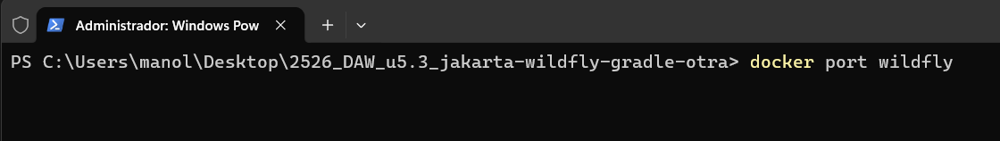

**Análisis:** Puerto 9990 NO expuesto, configuración segura aplicada.

#### Consola accesible solo internamente

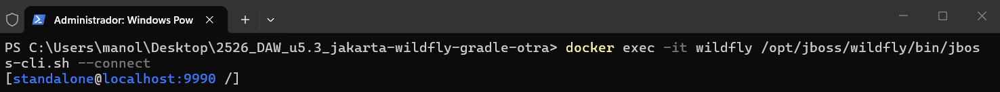

**Análisis:** Consola solo accesible mediante Docker exec, no desde el exterior.

#### Política de gestión de secretos

**Estructura de archivos:**
```
proyecto/
├── secrets/           # NO en Git
│   ├── db_username.txt
│   └── db_password.txt
├── .gitignore        # Excluye secrets/
└── docker-compose.yml
```

**Procedimiento de rotación:**
1. Generar nueva contraseña segura (mínimo 16 caracteres)
2. Actualizar `secrets/db_password.txt`
3. Reiniciar servicio: `docker-compose up -d --force-recreate wildfly`
4. Verificar logs: `docker logs wildfly`
5. Revocar credencial antigua

---

## e) Criterio E - Componentes web del servidor de aplicaciones

### ¿Qué es el WAR y qué contiene?

#### Definición

WAR (Web Application Archive) es un archivo comprimido en formato ZIP que empaqueta una aplicación web Java para su despliegue en un servidor de aplicaciones.

#### Contenido del WAR de P5.2 (crud-file.war)

```
crud-file.war
├── WEB-INF/
│   ├── web.xml                    # Descriptor de despliegue
│   ├── jboss-web.xml              # Configuración específica WildFly
│   └── classes/
│       └── com/example/tasks/
│           ├── Task.class             # Modelo de datos
│           ├── TaskResource.class     # Endpoint REST (JAX-RS)
│           ├── TaskStore.class        # Interfaz de persistencia
│           ├── FileTaskStore.class    # Implementación con archivos
│           └── TasksApplication.class # Configuración JAX-RS
└── index.html                     # Página de inicio
```

### Contexto/ruta base de la aplicación

#### Definición del contexto

El contexto es la ruta base bajo la cual se despliega la aplicación en el servidor. Todas las URLs de la aplicación comienzan con este prefijo.

#### Configuración en P5.2

**Archivo: jboss-web.xml**
```xml
<?xml version="1.0" encoding="UTF-8"?>
<jboss-web>
    <context-root>/crud-file</context-root>
</jboss-web>
```

**Resultado:**
- Contexto de la aplicación: `/crud-file`
- Todas las URLs comienzan con: `http://localhost:8080/crud-file/`

### Contenedor web: Undertow

#### Responsabilidades del contenedor web en WildFly

WildFly utiliza **Undertow** como contenedor web (servlet container), que se encarga de:

1. **Gestionar peticiones HTTP**
   - Escuchar en el puerto 8080
   - Parsear peticiones HTTP
   - Enrutar a la aplicación correspondiente según el contexto

2. **Inyección de dependencias (CDI)**
   - Gestionar el ciclo de vida de beans
   - Inyectar dependencias automáticamente

3. **JAX-RS (RESTEasy)**
   - Mapear rutas REST a métodos Java
   - Serializar/deserializar JSON automáticamente (JSON-B)
   - Gestionar content-type y headers

4. **Servlet API**
   - Gestionar sesiones HTTP
   - Filtros y listeners
   - Forward y redirect

### Desglose de URL real de P5.2

#### URL completa del endpoint

```
http://localhost:8080/crud-file/api/tasks
```

#### Desglose componente a componente

```
http://localhost:8080/crud-file/api/tasks
└─┬─┘ └───┬───┘ └──┬──┘ └┬┘ └─┬─┘
   1      2        3    4    5
```

**1. Protocolo: `http://`**
- Comunicación HTTP sin encriptación
- En producción: `https://` (mediante Nginx)

**2. Host: `localhost`**
- Servidor local (127.0.0.1)
- En producción: dominio real (e.g., `api.midominio.com`)

**3. Puerto: `8080`**
- Puerto HTTP por defecto de WildFly
- Mapeado desde el contenedor Docker: `8080:8080`
- En producción con Nginx: puerto 443 (HTTPS), Nginx redirige internamente a 8080

**4. Contexto de aplicación: `/crud-file`**
- Definido en `jboss-web.xml`
- Identifica la aplicación WAR desplegada
- WildFly enruta a `crud-file.war`

**5. Ruta base JAX-RS: `/api`**
- Definida en `TasksApplication.java`:
  ```java
  @ApplicationPath("/api")
  public class TasksApplication extends Application {
  }
  ```
- Agrupa todos los endpoints REST bajo `/api`

**6. Recurso REST: `/tasks`**
- Definido en `TaskResource.java`:
  ```java
  @Path("/tasks")
  public class TaskResource {
  }
  ```
- Mapea a la clase que gestiona tareas

### Evidencias

#### URLs probadas en navegador

**Página principal de la aplicación:**


URL: `http://localhost:8080/crud-file/`

**API REST - GET /api/tasks:**


URL: `http://localhost:8080/crud-file/api/tasks`

#### URLs probadas con curl

**GET - Listar tareas:**


**POST - Crear tarea:**


**PUT - Actualizar tarea:**


**DELETE - Eliminar tarea:**


#### Logs del servidor mostrando accesos

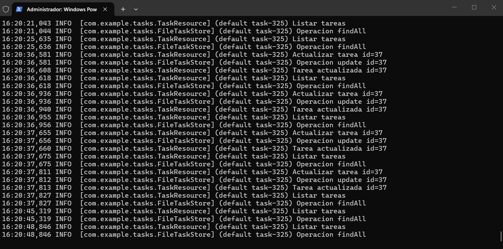

---

## f) Criterio F - Parámetros necesarios para el despliegue

### Parámetros del despliegue en P5.2

#### 1. Imagen de Docker: `quay.io/wildfly/wildfly`

**Configuración:**
```powershell
docker run -d quay.io/wildfly/wildfly
```

**Justificación:**
- Especifica la imagen oficial de WildFly

**¿Qué pasa si está mal?**
- Podría usar versión antigua no compatible con Jakarta EE 10
- Docker no puede crear el contenedor

---

#### 2. Nombre del contenedor: `--name wildfly`

**Configuración:**
```powershell
docker run -d --name wildfly quay.io/wildfly/wildfly
```

**Justificación:**
- Identificador único del contenedor
- Facilita gestión
- Permite referenciarlo por nombre en lugar de ID

**¿Qué pasa si está mal?**
- Docker asigna nombre aleatorio y esto es ineficiente y inutil

---

#### 3. Mapeo de puertos: `-p 8080:8080` y `-p 9990:9990`

**Configuración:**
```powershell
docker run -d --name wildfly \
  -p 8080:8080 \
  -p 9990:9990 \
  quay.io/wildfly/wildfly
```

**Justificación:**
- **8080:8080** → Mapea puerto HTTP de WildFly al host
  - Formato: `host:contenedor`
  - Permite acceso: `http://localhost:8080`
  
- **9990:9990** → Mapea consola de administración
  - Acceso a gestión del servidor

**¿Qué pasa si está mal?**

**Puerto incorrecto:**
- Confusión para usuarios

**Sin mapeo:**
- Aplicación inaccesible desde el host, solo dentro de la red Docker

---

#### 4. Nombre del archivo WAR: `archiveFileName = 'crud-file.war'`

**Configuración en build.gradle:**
```gradle
war {
    archiveFileName = 'crud-file.war'
}
```

**Justificación:**
- Define el nombre del archivo WAR generado
- Determina el contexto de despliegue por defecto
- Facilita identificación del archivo

**¿Qué pasa si está mal?**

- Problemas en sistemas de archivos
- WildFly no reconoce el archivo como aplicación web
- No se despliega automáticamente

---

#### 5. Ruta de despliegue: `/opt/jboss/wildfly/standalone/deployments/`

**Configuración:**
```powershell
docker cp build/libs/crud-file.war wildfly:/opt/jboss/wildfly/standalone/deployments/
```

**Justificación:**
- Directorio de deployment de WildFly
- Escaneo automático de nuevos archivos WAR
- Despliegue automático sin reinicio del servidor

**¿Qué pasa si está mal?**
- Archivo copiado a ubicación no monitoreada
- WildFly no detecta ni despliega la aplicación
- Posible error de permisos

---

## g) Criterio G - Pruebas de funcionamiento y rendimiento

### Pruebas Funcionales

Se realizaron pruebas exhaustivas de todas las operaciones CRUD de la API REST `/api/tasks` utilizando dos enfoques:

#### 1. Pruebas con curl (línea de comandos)

**GET - Listar tareas:**
```bash
curl http://localhost:8080/crud-file/api/tasks
```

**POST - Crear tarea:**
```bash
curl -X POST http://localhost:8080/crud-file/api/tasks ^
  -H "Content-Type: application/json" ^
  -d "{\"title\":\"Nueva tarea desde curl\",\"description\":\"Tarea de prueba\",\"completed\":false}"
```

**PUT - Actualizar tarea:**
```bash
curl -X PUT http://localhost:8080/crud-file/api/tasks/1 ^
  -H "Content-Type: application/json" ^
  -d "{\"title\":\"Tarea actualizada\",\"description\":\"Descripción modificada\",\"completed\":true}"
```

**DELETE - Eliminar tarea:**
```bash
curl -X DELETE http://localhost:8080/crud-file/api/tasks/1
```

#### 2. Pruebas desde navegador web

- **Acceso a interfaz:** `http://localhost:8080/crud-file/`
- **Funcionalidad probada:** 
  - Visualización de tareas en interfaz gráfica
  - Interacción con la API haciendo uso de la aplicación

### Pruebas de Rendimiento con HEY

#### Prueba: GET bajo carga moderada

**Comando utilizado:**
```bash
hey -H "Content-Type: application/json" http://localhost:8080/crud-file/api/tasks
```

**Parámetros:**
- `-n 200`: Total de 200 peticiones
- `-c 50`: 50 peticiones concurrentes simultáneas
- `-m GET`: Método HTTP GET

**Endpoint probado:** `/api/tasks`

**Análisis de resultados:**

| Métrica | Valor |
|---------|-------|
| **Peticiones totales** | 200 |
| **Peticiones/segundo** | 480.35 rps |
| **Latencia promedio** | 81.9 ms |
| **Latencia p50** | 24.7 ms |
| **Latencia p95** | 349.1 ms |
| **Latencia p99** | 374.7 ms |
| **Errores HTTP** | 0 |

**Evidencias:**

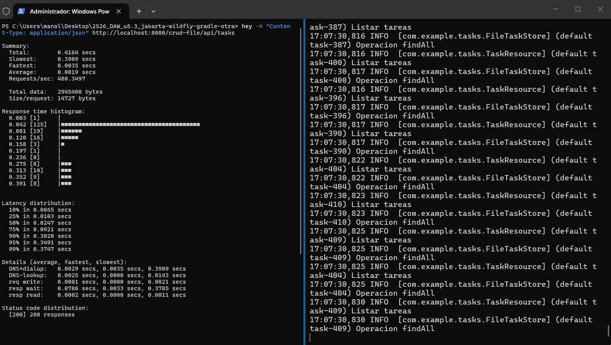

---

## h) Criterio H - Documentación de administración y recomendaciones

**Mini-guía de administración para el despliegue de WildFly + Nginx con Docker Compose.**

### 1. Requisitos previos

- Docker Desktop 20.10+
- Docker Compose 2.0+
- Java 17 y Gradle 8+

### 2. Arquitectura del despliegue

```
Internet → Nginx (80/443) → WildFly (8080) → crud-file.war
         [nginx-proxy]     [wildfly-app]     [/api/tasks]
```

**Ficheros clave:**
- `docker-compose.yml` - Orquestación de servicios
- `build/libs/crud-file.war` - Aplicación compilada
- `nginx/nginx.conf` - Configuración del reverse proxy
- `secrets/wildfly_admin_password.txt` - Credenciales

### 3. Levantar WildFly y servicios

```powershell
# 1. Compilar la aplicación
.\gradlew clean build

# 2. Levantar servicios
docker-compose up -d

# 3. Verificar estado (esperar a "healthy")
docker-compose ps
```

### 4. Desplegar una nueva versión del WAR

**Opción A: Con recompilación**
```powershell
.\gradlew clean build
docker-compose restart wildfly
```

**Opción B: Hot deployment**
```powershell
.\gradlew clean build
# WildFly detecta cambios automáticamente en ./build/libs
docker-compose logs -f wildfly
```

**Opción C: Recrear desde cero**
```powershell
.\gradlew clean build
docker-compose down
docker-compose up -d
```

### 5. Comprobar el estado del despliegue

**Verificar servicios:**
```powershell
docker-compose ps
# Debe mostrar: Up (healthy)
```

**Verificar logs:**
```powershell
# WildFly
docker-compose logs -f wildfly

# Nginx
docker-compose logs -f nginx

# Buscar errores
docker-compose logs wildfly | findstr "ERROR"
```

**Probar endpoint:**
```powershell
curl http://localhost/crud-file/api/tasks
```

**Monitorear recursos:**
```powershell
docker stats wildfly-app nginx-proxy
```

### 6. URLs de prueba

| Endpoint | URL |
|----------|-----|
| Interfaz web | `http://localhost/crud-file/` |
| GET tareas | `http://localhost/crud-file/api/tasks` |
| POST crear | `http://localhost/crud-file/api/tasks` |
| PUT actualizar | `http://localhost/crud-file/api/tasks/{id}` |
| DELETE eliminar | `http://localhost/crud-file/api/tasks/{id}` |

**Pruebas CRUD:**
```powershell
# GET
curl http://localhost/crud-file/api/tasks

# POST
curl -X POST http://localhost/crud-file/api/tasks `
  -H "Content-Type: application/json" `
  -d '{\"title\":\"Nueva tarea\",\"description\":\"Prueba\",\"completed\":false}'

# PUT
curl -X PUT http://localhost/crud-file/api/tasks/1 `
  -H "Content-Type: application/json" `
  -d '{\"title\":\"Actualizada\",\"description\":\"Modificada\",\"completed\":true}'

# DELETE
curl -X DELETE http://localhost/crud-file/api/tasks/1
```

### 7. Pruebas de rendimiento con HEY

```powershell
# Prueba de carga
hey -n 200 -c 50 -m GET http://localhost/crud-file/api/tasks

# Métricas esperadas:
# - Requests/sec: > 400 rps
# - Latencia promedio: < 100 ms
# - Errores: 0%
```

### 8. Recomendaciones de seguridad

1. **Secretos:** No versionar en Git, permisos restrictivos
   ```powershell
   echo "secrets/" >> .gitignore
   icacls secrets\wildfly_admin_password.txt /inheritance:r /grant:r "$env:USERNAME:(R)"
   ```

2. **Aislamiento de red:** WildFly solo accesible vía Nginx
   ```powershell
   # WildFly NO debe responder directamente
   curl http://localhost:8080/crud-file/api/tasks  # ERROR esperado
   ```

3. **Limitación de recursos:** Configurada en docker-compose.yml
   - WildFly: 2 CPU, 1536 MB RAM
   - Nginx: 1 CPU, 256 MB RAM

4. **Logs rotados:** 10 MB máx, 3 archivos por servicio

5. **Healthchecks:** Monitoreo automático cada 30s

6. **SSL/TLS (producción):**
   ```powershell
   openssl req -x509 -nodes -days 365 -newkey rsa:2048 `
     -keyout nginx\ssl\key.pem -out nginx\ssl\cert.pem
   ```

### 9. Errores comunes y soluciones

| Problema | Causa | Solución |
|----------|-------|----------|
| **502 Bad Gateway** | WildFly no está healthy | Esperar 60s o `docker-compose restart wildfly` |
| **415 Unsupported Media Type** | Falta header Content-Type | Añadir `-H "Content-Type: application/json"` |
| **Puerto 80 ocupado** | IIS u otro servicio activo | Detener servicio o cambiar puerto en compose |
| **Contenedor unhealthy** | Error en despliegue del WAR | Ver `docker-compose logs wildfly` |
| **Datos no persisten** | Volumen no montado | Verificar `docker inspect wildfly-app` |

### 10. Comandos rápidos de referencia

```powershell
# Levantar
docker-compose up -d

# Estado
docker-compose ps

# Logs
docker-compose logs -f

# Reiniciar
docker-compose restart wildfly

# Detener
docker-compose stop

# Eliminar todo
docker-compose down -v

# Recompilar y redesplegar
.\gradlew clean build && docker-compose restart wildfly

# Prueba rápida
curl http://localhost/crud-file/api/tasks

# Monitoreo
docker stats wildfly-app nginx-proxy
```

---

## i) Criterio I - Virtualización, nube o contenedores en el despliegue

### Arquitectura del despliegue con Docker Compose

Se ha implementado un despliegue completo utilizando **Docker Compose** que integra tres componentes principales:

1. **Nginx** - Servidor web y reverse proxy
2. **WildFly** - Servidor de aplicaciones Jakarta EE
3. **Aplicación REST** - API CRUD de tareas (`crud-file.war`)

### Archivo docker-compose.yml completo

```yaml
version: '3.8'

services:
  wildfly:
    image: quay.io/wildfly/wildfly:latest
    container_name: wildfly-app
    hostname: wildfly-app
    
    networks:
      - backend
    
    # Exponer puertos solo internamente (no al host)
    expose:
      - "8080"
      - "9990"
    
    # Volúmenes para despliegue y logs
    volumes:
      - ./build/libs:/opt/jboss/wildfly/standalone/deployments:ro
      - wildfly-logs:/opt/jboss/wildfly/standalone/log
      - wildfly-data:/opt/jboss/wildfly/standalone/data
    
    # Variables de entorno y secretos
    environment:
      - WILDFLY_USER=admin
      - JAVA_OPTS=-Xms512m -Xmx1024m -XX:MetaspaceSize=256m -XX:MaxMetaspaceSize=512m
    
    secrets:
      - wildfly_admin_password
    
    # Healthcheck
    healthcheck:
      test: ["CMD", "curl", "-f", "http://localhost:8080/crud-file/api/tasks"]
      interval: 30s
      timeout: 10s
      retries: 3
      start_period: 60s
    
    # Reinicio automático
    restart: unless-stopped
    
    # Limitación de recursos
    deploy:
      resources:
        limits:
          cpus: '2.0'
          memory: 1536M
        reservations:
          cpus: '0.5'
          memory: 512M
    
    # Logging
    logging:
      driver: "json-file"
      options:
        max-size: "10m"
        max-file: "3"
  
  nginx:
    image: nginx:alpine
    container_name: nginx-proxy
    hostname: nginx-proxy
    
    networks:
      - backend
    
    # Puertos expuestos al host
    ports:
      - "80:80"
      - "443:443"
    
    # Volúmenes para configuración, SSL y logs
    volumes:
      - ./nginx/nginx.conf:/etc/nginx/nginx.conf:ro
      - ./nginx/ssl:/etc/nginx/ssl:ro
      - nginx-logs:/var/log/nginx
      - nginx-cache:/var/cache/nginx
    
    # Dependencias
    depends_on:
      wildfly:
        condition: service_healthy
    
    # Healthcheck
    healthcheck:
      test: ["CMD", "wget", "--quiet", "--tries=1", "--spider", "http://localhost/health"]
      interval: 30s
      timeout: 10s
      retries: 3
      start_period: 10s
    
    # Reinicio automático
    restart: unless-stopped
    
    # Limitación de recursos
    deploy:
      resources:
        limits:
          cpus: '1.0'
          memory: 256M
        reservations:
          cpus: '0.25'
          memory: 64M
    
    # Logging
    logging:
      driver: "json-file"
      options:
        max-size: "10m"
        max-file: "3"

# Redes
networks:
  backend:
    driver: bridge
    ipam:
      config:
        - subnet: 172.20.0.0/16

# Volúmenes persistentes
volumes:
  wildfly-logs:
    driver: local
  wildfly-data:
    driver: local
  nginx-logs:
    driver: local
  nginx-cache:
    driver: local

# Secretos
secrets:
  wildfly_admin_password:
    file: ./secrets/wildfly_admin_password.txt
```

### Características implementadas

#### 1. Volúmenes
- Volúmenes para WildFly
- Volúmenes para Nginx

#### 2. Secretos

**Implementación:**
```yaml
secrets:
  wildfly_admin_password:
    file: ./secrets/wildfly_admin_password.txt
```

**Estructura de archivos:**
```
secrets/
└── wildfly_admin_password.txt
```

#### 3. Healthchecks

**WildFly Healthcheck:**
```yaml
healthcheck:
  test: ["CMD", "curl", "-f", "http://localhost:8080/crud-file/api/tasks"]
  interval: 30s
  timeout: 10s
  retries: 3
  start_period: 60s
```

**Nginx Healthcheck:**
```yaml
healthcheck:
  test: ["CMD", "wget", "--quiet", "--tries=1", "--spider", "http://localhost/health"]
  interval: 30s
  timeout: 10s
  retries: 3
  start_period: 10s
```

#### 4. Reinicio automático

```yaml
restart: unless-stopped
```

#### 5. Limitación de recursos

**WildFly:**
```yaml
deploy:
  resources:
    limits:
      cpus: '2.0'
      memory: 1536M
    reservations:
      cpus: '0.5'
      memory: 512M
```

**Nginx:**
```yaml
deploy:
  resources:
    limits:
      cpus: '1.0'
      memory: 256M
    reservations:
      cpus: '0.25'
      memory: 64M
```

#### 6. Redes

```yaml
networks:
  backend:
    driver: bridge
    ipam:
      config:
        - subnet: 172.20.0.0/16
```

#### 7. Logging

```yaml
logging:
  driver: "json-file"
  options:
    max-size: "10m"
    max-file: "3"
```